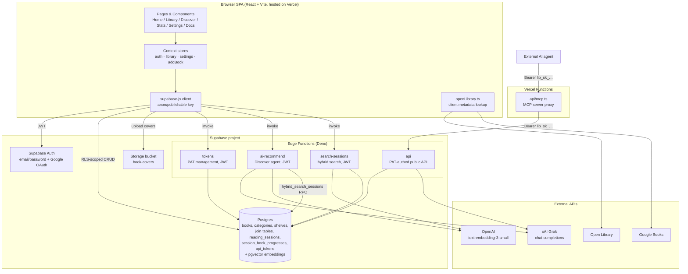

# Architecture — Personal Online Library ("Capy Books")

> Generated from a review of the repository's source, configuration, and
> dependency manifests. Anything that could not be confirmed from the files is
> marked **[to be verified]**. No secret values are listed — only their names
> and roles.

## 1. System overview

Capy Books is a responsive single-page web app (React + Vite + TypeScript) for
cataloguing a personal book collection — adding books, tracking reading
status/progress, rating and reviewing them, organising them into categories and
shelves, and logging dated reading sessions (with mood, minutes, notes and
quotes). User data is persisted per-account in Supabase (Postgres + Auth +
Storage), and the app ships an AI "Discover" agent powered by Grok (xAI) that
recommends books grounded in the user's library and reading journal, using a
hybrid full-text + semantic search over reading sessions. The app also exposes a
first-party **public per-user HTTP API** (authenticated by personal access
tokens) and an **MCP server** (deployed as a Vercel Function) so external AI
agents can read and modify a user's library. Book metadata and covers are
enriched on the client from Open Library and Google Books.

> Historical note: `PRD.md` describes a v1 that was local-storage-only with no
> accounts. The current code has moved past that — auth and a Supabase backend
> are implemented, and `src/lib/storage.ts` (localStorage + schema migrations)
> now appears to serve mainly as the seed-category source and legacy schema
> definition rather than the live persistence layer. **[to be verified]** whether
> any runtime path still reads/writes `localStorage` for library data.

## 2. Architecture diagram



## 3. Components

### Frontend (SPA)

| Component | Responsibility | Technology |
|---|---|---|
| App shell / router (`src/App.tsx`, `components/layout/`) | View switching (home/library/discover/stats/settings/docs) via local state + History API; gates on Supabase config and auth | React 18, TypeScript |
| Pages (`src/pages/`) | `HomePage`, `LibraryPage`, `DiscoverPage`, `StatsPage`, `SettingsPage`, `DocsPage`, `AuthPage` | React |
| Auth store (`src/store/auth.tsx`) | Wraps Supabase Auth; exposes user/session, sign-in/up, Google OAuth, sign-out | React Context, `@supabase/supabase-js` |
| Library store (`src/store/library.tsx`) | Source of truth for books/categories/shelves/sessions; optimistic `useReducer` updates with async Supabase writes and `resync()` on error | React Context, supabase-js |
| Settings / AddBook stores | App settings and the add-book flow state | React Context |
| Book components (`components/book/`) | Cards, detail, form, grid, cover image, progress bar, star rating, tag multiselect, barcode scanner | React, `@zxing/browser` (barcode) |
| Docs components (`components/docs/`) | In-app API & MCP reference, API token manager, code blocks | React |
| UI primitives (`components/ui/`) | Buttons, dialog, select, slider, tabs, etc. | Radix UI, class-variance-authority, tailwind-merge |
| Metadata lookup (`src/lib/openLibrary.ts`) | Multi-source title/cover/ISBN search and enrichment | Open Library + Google Books REST |
| AI client (`src/lib/aiRecommend.ts`) | Calls `ai-recommend` edge function; enriches recommendations with covers | supabase-js `functions.invoke` |
| Cover upload (`src/lib/coverStorage.ts`) | Validates and uploads cover images to the `book-covers` bucket | Supabase Storage |
| Local storage / migrations (`src/lib/storage.ts`) | Seed categories, `LibraryState` schema v5 + v1→v5 migrations | localStorage |

### Backend — Supabase Edge Functions (Deno, `supabase/functions/`)

| Function | Responsibility | Auth (per `config.toml`) |
|---|---|---|
| `api` | Public per-user HTTP API: `POST /books`, `GET /library`, `POST /sessions`, `POST /recommend`. Resolves a PAT to a `user_id`, then acts via the service-role client | `verify_jwt = false` — does **its own** PAT auth in code |
| `tokens` | First-party PAT management for the Docs page: create (returns plaintext once), list (metadata only), revoke. Stores only SHA-256 hashes | `verify_jwt = true` + re-checks `auth.getUser()` |
| `ai-recommend` | The Discover agent: Grok chat grounded in the user's library + tool-call into `search_reading_sessions` | `verify_jwt = true`; resolves user via `getUser()` |
| `search-sessions` | Direct hybrid (full-text + vector + RRF) search over the caller's reading sessions | `verify_jwt = true`; resolves user via `getUser()` |
| `_shared/auth.ts` | PAT hashing/generation and `authenticatePat()` | Deno, Web Crypto |
| `_shared/grok.ts` | Grok agent logic, system-prompt building, tool loop (max 3 rounds), reply parsing | OpenAI SDK pointed at xAI endpoint |
| `_shared/sessionSearch.ts` | Embeds query (OpenAI), runs `hybrid_search_sessions` RPC, enriches hits with book titles | Deno |
| `_shared/mapping.ts`, `_shared/cors.ts` | Row↔model mapping; CORS/JSON helpers | Deno |

### Backend — Vercel Function

| Component | Responsibility | Technology |
|---|---|---|
| MCP server (`api/mcp.ts`) | Exposes the per-user API to AI agents over MCP (Streamable HTTP). Thin, secret-less proxy: forwards the caller's PAT to the Supabase `api` function. Tools: `get_library`, `add_books`, `add_reading_session`, `recommend_books` | `mcp-handler`, `@modelcontextprotocol/sdk`, `zod`, `@vercel/node` |

## 4. Data sources

### Supabase Postgres

Tables inferred from queries (no migration files are tracked in the repo, so
columns are derived from usage — **[to be verified]** against the live schema):

| Table | Stores | Queried by |
|---|---|---|
| `books` | id, user_id, title, author, cover, status, progress, rating, notes, isbn, pages, publish_year, description, created_at, updated_at | Frontend store + `api`/`ai-recommend` (filtered by `user_id`) |
| `categories` | id, user_id, name | Frontend store, `api`, `ai-recommend` |
| `shelves` | id, user_id, name, color | Frontend store, `api` |
| `book_categories` | book_id, category_id, user_id (join) | All read/library paths |
| `book_shelves` | book_id, shelf_id, user_id (join) | All read/library paths |
| `reading_sessions` | id, user_id, date, minutes, mood, notes, quote, quote_page, created_at, + embedding vector **[to be verified]** | Frontend store, `api`, hybrid search |
| `session_book_progresses` | session_id, book_id, user_id, new_progress | Library reads, session enrichment |
| `api_tokens` | id, user_id, name, token_hash (SHA-256), token_prefix, created_at, last_used_at, revoked_at | `tokens` (CRUD), `_shared/auth.ts` (verify) |

- **Access from the browser** is via supabase-js with the anon/publishable key
  and is scoped by `user_id` filters; row-level security is assumed to enforce
  per-user isolation **[to be verified]** (no policy SQL in repo).
- **Access from edge functions** uses the **service-role key** (RLS-bypassing),
  with every query explicitly filtered by the resolved `user_id`.

### pgvector / semantic search

- Reading-session embeddings are stored in Postgres and queried by the
  `hybrid_search_sessions` Postgres RPC (full-text + vector + Reciprocal Rank
  Fusion, plus most-recent sessions). The function/extension SQL is **not in the
  repo** — **[to be verified]** (extension name `pgvector`, embedding dimension,
  how/when vectors are populated on insert).
- Query embeddings are generated at request time with OpenAI
  `text-embedding-3-small` (must match the model used to build stored vectors).

### Supabase Storage

- Bucket `book-covers`, public, 5 MB limit. Files stored at
  `<userId>/<uuid>.<ext>` so RLS can scope writes to the owner's folder
  (`src/lib/coverStorage.ts`).

### External book-metadata APIs (client-side, unauthenticated reads)

- **Open Library** — `search.json`, `/works/...`, covers CDN.
- **Google Books** — `volumes` search; optional API key
  `VITE_GOOGLE_BOOKS_API_KEY` if present.

## 5. Integrations & connections

| Integration | Direction | Auth (type, no secrets) |
|---|---|---|
| Supabase Auth | Browser → Supabase (out) | Email/password + Google OAuth; JWT session in browser, redirect to `window.location.origin` |
| Supabase Postgres / Storage | Browser → Supabase (out) | Anon/publishable key + user JWT; RLS-scoped |
| Edge function `tokens` | Browser → Supabase (out) | User JWT forwarded by `functions.invoke` |
| Edge function `ai-recommend` | Browser → Supabase (out) | User JWT |
| Edge function `search-sessions` | Browser → Supabase (out) | User JWT |
| Public API `api` | External client / MCP → Supabase (in) | Personal access token `Authorization: Bearer lib_sk_…`; verified by SHA-256 hash lookup |
| MCP server (`/api/mcp`) | External AI agent → Vercel (in) | Bearer PAT (`lib_sk_…`); `withMcpAuth` does an O(1) format check, real authz enforced downstream by `api` |
| xAI Grok | Edge function → xAI (out) | `XAI_API_KEY` (server secret); OpenAI-compatible endpoint `https://api.x.ai/v1`; model `grok-4.3` (override `XAI_MODEL`) |
| OpenAI embeddings | Edge function → OpenAI (out) | `OPENAI_API_KEY` (server secret) |
| Open Library / Google Books | Browser → external (out) | None / optional `VITE_GOOGLE_BOOKS_API_KEY` |

No webhooks, queues, or cron jobs are defined in the repository. **[to be verified]**
whether any Supabase database webhooks/triggers populate session embeddings.

### Environment variables (names & roles only)

Frontend (`VITE_`-prefixed, bundled into the browser):
- `VITE_SUPABASE_URL` — Supabase project URL.
- `VITE_SUPABASE_PUBLISHABLE_KEY` — public/anon key for supabase-js.
- `VITE_GOOGLE_BOOKS_API_KEY` — optional, raises Google Books quota. **[to be verified]** (read in code; not in `.env.example`).

Server-side only (never `VITE_`-prefixed):
- `XAI_API_KEY` — Grok access (Supabase secret).
- `XAI_MODEL` — optional model override.
- `OPENAI_API_KEY` — query embeddings (Supabase secret).
- `SUPABASE_URL`, `SUPABASE_ANON_KEY`, `SUPABASE_SERVICE_ROLE_KEY` — injected into edge functions by the platform.
- `SUPABASE_API_URL` — optional override of the API base used by the MCP server (defaults to the deployed `…/functions/v1/api`).

## 6. Data flow

### Library CRUD (read/write)
1. User acts in a page → calls a method on the **library store**.
2. Store dispatches an **optimistic** reducer update (instant UI) and fires an
   async supabase-js write scoped to `user_id`.
3. On write error, the store logs and calls `resync()` to re-fetch the full
   library from Postgres, reconciling UI back to server truth.
4. Initial load: on sign-in, the store fetches books, shelves, categories, both
   join tables, sessions and session progresses in parallel and hydrates state;
   a brand-new empty account is seeded with default categories.

### Add-a-book enrichment
1. User types a title/ISBN → `openLibrary.ts` queries Google Books first, falls
   back to Open Library, with language-aware ranking from `navigator.language`.
2. Selected metadata (cover, ISBN, pages, year, description) pre-fills the form;
   a manually chosen cover image is uploaded to the `book-covers` bucket.

### Reading session logging
1. User logs a session (date, minutes, mood, notes, quote, per-book progress).
2. Store writes `reading_sessions` + `session_book_progresses` and patches each
   affected book's `progress`/`status` (≥100 → `finished`; `to-read` → `reading`).
   The `api` edge function mirrors the same transition logic for API/MCP callers.

### Discover AI recommendation (human-in-the-loop)
1. Browser sends the running chat + a compact library profile to `ai-recommend`.
2. Function resolves the user from JWT, then calls Grok. Grok may call the
   `search_reading_sessions` tool → `searchSessions` embeds the query (OpenAI) →
   `hybrid_search_sessions` RPC → results enriched with book titles → fed back to
   Grok (looped up to 3 tool rounds).
3. Grok returns strict JSON `{ reply, books[] }`; the client renders the reply
   and **the user explicitly decides** whether to add a recommended book to their
   library (the human-in-the-loop gateway — nothing is written automatically).

### External agent via API / MCP
1. Agent calls `/api/mcp` (Vercel) or the `api` function directly with a PAT.
2. PAT is hashed (SHA-256) and matched against `api_tokens`; `last_used_at` is
   bumped best-effort. The resolved `user_id` scopes all reads/writes.
3. MCP `recommend_books` proxies to `POST /recommend`, reusing the Grok path
   (note: the PAT `api` path runs Grok **without** the session-search tool).

## 7. Hosting & deployment

- **Frontend**: static SPA built by Vite (`npm run build` → `tsc -b && vite build`),
  hosted on **Vercel**. `vercel.json` rewrites all paths to `/index.html`
  (client-side routing; `/docs` is the one path-synced view).
- **MCP server**: Vercel Function at `/api/mcp` (`api/mcp.ts`), `maxDuration` 60s,
  `@vercel/node` runtime.
- **Backend**: Supabase-managed — Postgres, Auth, Storage, and four Deno Edge
  Functions. Function JWT gating is set in `supabase/config.toml`. Deployment of
  functions and secrets is via the Supabase CLI (`supabase secrets set …`,
  `supabase functions deploy …` **[to be verified]** — no CI config in repo).
- **Deployed Supabase project ref** appears in `api/mcp.ts` default
  (`eqdyttfwnelnlsbiqhwx.supabase.co`). **[to be verified]** as the current prod ref.
- **Local dev**: `npm run dev` (Vite, port 5173) or `npm run preview` (port 4173),
  per `.claude/launch.json`. Copy `.env.example` → `.env.local` for Supabase vars.
- No Dockerfile, docker-compose, cron, or tmux configuration is present in the repo.

## 8. Open questions / TODO

- **Database schema is not in the repo.** No `supabase/migrations/` — exact
  columns, types, constraints, and the `hybrid_search_sessions` RPC + pgvector
  setup are inferred from query usage only. **[to be verified]**
- **RLS policies** are assumed but not present as SQL. Confirm every table
  (and the `book-covers` bucket) has per-user row-level security. **[to be verified]**
- **Session embeddings**: how/when are `reading_sessions` vectors generated and
  stored (insert trigger? batch job? edge function?) and what dimension/model? **[to be verified]**
- **localStorage vs Supabase**: is `src/lib/storage.ts` still a live persistence
  path, or purely legacy/seed code now that the backend exists? **[to be verified]**
- **`VITE_GOOGLE_BOOKS_API_KEY`** is read in code but absent from `.env.example` —
  document it or remove the dependency. **[to be verified]**
- **Deployment pipeline**: no CI/CD config found. How are the frontend, edge
  functions, and secrets actually promoted to production? **[to be verified]**
- **Production URLs**: confirm the live Vercel domain and Supabase project ref
  (the MCP default points at `eqdyttfwnelnlsbiqhwx`). **[to be verified]**
- **Barcode scanning** (`@zxing`) — confirm it is wired into the add-book flow
  end to end. **[to be verified]**
```
